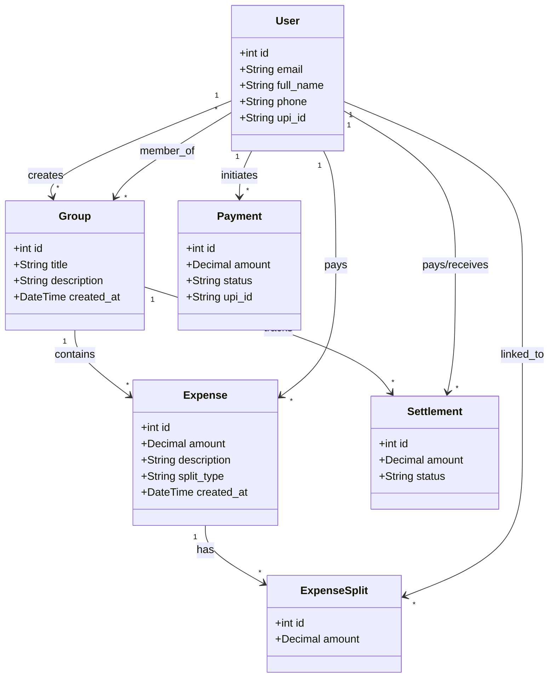

# 5.2.1 Coding Details: Paynion Project

## 1. Project Configuration (settings.py)

```python
import os
from pathlib import Path
from dotenv import load_dotenv

# Base Directory
BASE_DIR = Path(__file__).resolve().parent.parent

# Load Environment Variables
load_dotenv(BASE_DIR / ".env")

# Security
SECRET_KEY = 'django-insecure-^g*sl@$q*ar@)ehyn50s@+nj@&n-j(&7y7^_qn+)09yew$ijul'
DEBUG = True
ALLOWED_HOSTS = ["*"]

# Installed Apps
INSTALLED_APPS = [
    'django.contrib.admin',
    'django.contrib.auth',
    'django.contrib.contenttypes',
    'django.contrib.sessions',
    'django.contrib.messages',
    'django.contrib.staticfiles',
    'accounts',
    'groups',
    'expenses',
    'payments',
]

# Database Connection (MySQL)
DATABASES = {
    'default': {
        'ENGINE': 'django.db.backends.mysql',
        'NAME': 'paynion_db',
        'USER': 'root',
        'PASSWORD': 'root',
        'HOST': 'localhost',
        'PORT': '3306',
        'OPTIONS': {
            'init_command': "SET sql_mode='STRICT_TRANS_TABLES'"
        }
    }
}

# Email Configuration (Gmail SMTP)
EMAIL_BACKEND = "django.core.mail.backends.smtp.EmailBackend"
EMAIL_HOST = "smtp.gmail.com"
EMAIL_PORT = 587
EMAIL_USE_TLS = True
EMAIL_HOST_USER = "itizamritamishra@gmail.com"
EMAIL_HOST_PASSWORD = "yvxhjcylgdbnapfo"  # App Password
DEFAULT_FROM_EMAIL = EMAIL_HOST_USER

# Static & Media Files
STATIC_URL = 'static/'
STATICFILES_DIRS = [BASE_DIR / 'static']
STATIC_ROOT = BASE_DIR / 'staticfiles'

MEDIA_URL = '/media/'
MEDIA_ROOT = BASE_DIR / 'media'

# Custom User Model
AUTH_USER_MODEL = 'accounts.CustomUser'

# Razorpay Keys
RAZORPAY_KEY_ID = os.getenv("RAZORPAY_KEY_ID")
RAZORPAY_KEY_SECRET = os.getenv("RAZORPAY_KEY_SECRET")
```

## 2. Key Models (Database Structure)

```python
# accounts/models.py
class CustomUser(AbstractUser):
    email = models.EmailField(unique=True)
    full_name = models.CharField(max_length=255)
    phone = models.CharField(max_length=10, blank=True, null=True)
    profile_image = models.ImageField(upload_to=user_profile_path, default='default_profile.jpg')
    upi_id = models.CharField(max_length=100, blank=True, null=True)

# groups/models.py
class Group(models.Model):
    title = models.CharField(max_length=255)
    description = models.TextField(blank=True, null=True)
    members = models.ManyToManyField(User, related_name="group_members")
    created_by = models.ForeignKey(User, on_delete=models.CASCADE)
    created_at = models.DateTimeField(auto_now_add=True)

# expenses/models.py
class Expense(models.Model):
    group = models.ForeignKey(Group, on_delete=models.CASCADE)
    amount = models.DecimalField(max_digits=10, decimal_places=2)
    description = models.CharField(max_length=255)
    paid_by = models.ForeignKey(User, on_delete=models.CASCADE)
    split_type = models.CharField(max_length=20, default="equal")
    created_at = models.DateTimeField(auto_now_add=True)

class ExpenseSplit(models.Model):
    expense = models.ForeignKey(Expense, on_delete=models.CASCADE)
    user = models.ForeignKey(User, on_delete=models.CASCADE)
    amount = models.DecimalField(max_digits=10, decimal_places=2)

# payments/models.py
class Settlement(models.Model):
    group = models.ForeignKey(Group, on_delete=models.CASCADE)
    payer = models.ForeignKey(User, related_name="payments_to_make", on_delete=models.CASCADE)
    receiver = models.ForeignKey(User, related_name="payments_to_receive", on_delete=models.CASCADE)
    amount = models.DecimalField(max_digits=10, decimal_places=2)
    status = models.CharField(max_length=20, default="PENDING")  # PENDING, PAID, SETTLED
```

## 3. Core Logic & Views

### Add Expense Logic (expenses/views.py)
```python
@login_required
def add_expense(request, group_id):
    group = get_object_or_404(Group, id=group_id)

    if request.method == "POST":
        form = ExpenseForm(request.POST, group=group)
        if form.is_valid():
            expense = form.save(commit=False)
            expense.group = group
            expense.paid_by = request.user
            expense.save()

            users = form.cleaned_data["split_between"]

            # Handle different split types
            if expense.split_type == "equal":
                handle_equal_split(expense, users)
            elif expense.split_type == "percentage":
                handle_percentage_split(expense, users, request.POST)
            elif expense.split_type == "custom":
                handle_custom_split(expense, users, request.POST)

            # Send Notifications
            for member in users:
                if member != request.user:
                    Notification.objects.create(
                        user=member,
                        message=f"₹{expense.amount} added in group '{group.title}'"
                    )

            return redirect("groups:group_detail", group.id)
    else:
        form = ExpenseForm(group=group)

    return render(request, "expenses/expense_form.html", {"form": form, "group": group})
```

### Group Invite Logic (groups/views.py)
```python
@login_required
def send_group_invite(request, group_id):
    if request.method == "POST":
        email = request.POST.get("email")
        group = get_object_or_404(Group, id=group_id)
        
        # Create Invite Token
        invite = GroupInvite.objects.create(email=email, group=group, invited_by=request.user)
        invite_link = f"http://127.0.0.1:8000/groups/invite/accept/{invite.token}/"

        # Send Email
        send_mail(
            subject=f"Invite to join {group.title}",
            message=f"Click below to join:\n{invite_link}",
            from_email=settings.DEFAULT_FROM_EMAIL,
            recipient_list=[email],
            fail_silently=False
        )
        return redirect("groups:group_detail", group_id=group.id)
        return redirect("groups:group_detail", group_id=group.id)
```

## 4. Database Schema Diagram


